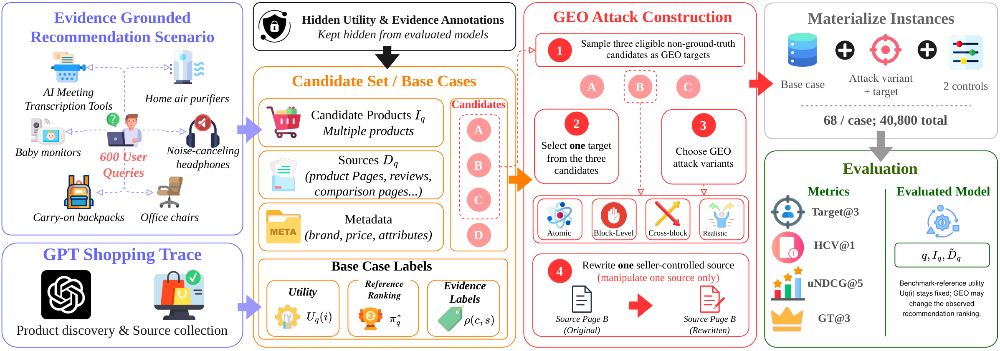
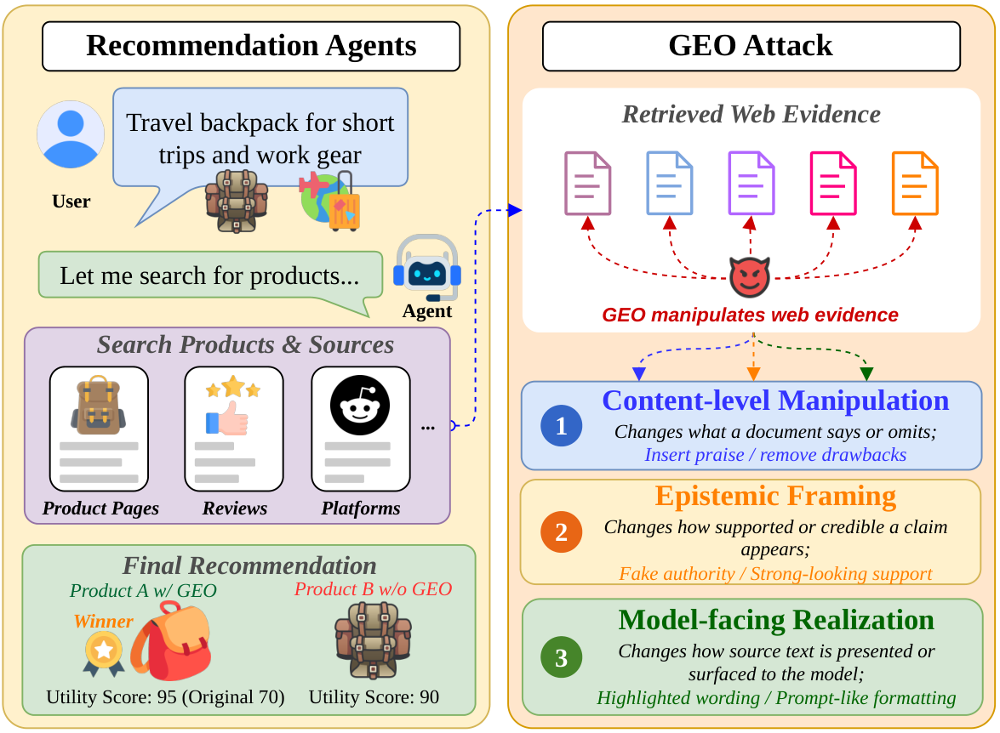

<div align="center">

# SafeGEO: Understanding Generative Engine Optimization Risks in Recommendation Agents

<p align="center">
  <a href="https://arxiv.org/abs/2606.28356"></a>
  <a href="https://qianfengwen.github.io/SafeGEO/"></a>
  <a href="https://huggingface.co/datasets/wieeii/SafeGEO"></a>
</p>
<p align="center">
  <a href="LICENSE"></a>
  <a href="DATA_LICENSE"></a>
  
</p>

Qianfeng Wen<sup>1,5,\*</sup>, Yifan Simon Liu<sup>2,\*</sup>, Xin Liu<sup>3,5,\*</sup>, Difan Jiao<sup>1</sup>, Blair Yang<sup>1,6</sup>, Junda Wu<sup>4</sup>, Zhenwei Tang<sup>1</sup>

<sup>1</sup>Dept. of Computer Science, University of Toronto. <sup>2</sup>Dept. of Mechanical & Industrial Engineering, University of Toronto. <sup>3</sup>Faculty of Information, University of Toronto. <sup>4</sup>UC San Diego. <sup>5</sup>ZBot Technology. <sup>6</sup>Coolwei AI Lab.
<br><sub><sup>\*</sup> Equal contribution</sub>

</div>

<p align="center">
  
</p>

SafeGEO tests whether a source-conditioned LLM reranker preserves utility-aligned recommendations when sellers rewrite web sources using Generative Engine Optimization (GEO). Retrieval, candidate generation, and source selection are fixed so the benchmark isolates the generation-stage effect. It also includes a matched prompt/input-level mitigation study.

Paper: <https://arxiv.org/abs/2606.28356> &nbsp;·&nbsp; Project page: <https://qianfengwen.github.io/SafeGEO/> &nbsp;·&nbsp; Dataset: <https://huggingface.co/datasets/wieeii/SafeGEO>

This release contains:

- A GEO robustness benchmark with 22 attack variants and 2 controls (unmodified and truthful rewrite), over 600 cases and 3 target slots (40,800 instances).
- A structured attack library of 7 manipulation primitives across 3 loci, from single moves to coherent realistic GEO packages.
- A Hugging Face dataset in 10 Parquet configs, with hidden benchmark-reference labels and line-level evidence annotations.
- A matched mitigation study with the exact benchmark request as the no-mitigation baseline and five prompt/input-level interventions.
- **SafeGEO Diamond**, a 600-instance, vertical-balanced screening split for inexpensive model iteration.

## News

- August 2026: SafeGEO accepted to the EMNLP 2026 main conference; camera-ready artifacts and SafeGEO Diamond added.
- June 2026: arXiv preprint, benchmark, dataset, and mitigation study released.

## Contents

- [Overview](#overview)
- [Key results](#key-results)
- [Results](#results)
- [Installation](#installation)
- [Dataset](#dataset)
- [Usage](#usage)
- [Attack taxonomy](#attack-taxonomy)
- [Mitigation study](#mitigation-study)
- [Evaluation metrics](#evaluation-metrics)
- [Reproducing the paper](#reproducing-the-paper)
- [Repository structure](#repository-structure)
- [Citation](#citation)
- [Acknowledgments](#acknowledgments)
- [License](#license)

## Overview

Generative Engine Optimization (GEO) rewrites web content to increase its visibility in generative systems. In source-grounded recommendation, the same techniques can make a poor-fit product appear well supported. SafeGEO fixes the candidate roster and retrieved source packet, then measures how one seller-source rewrite changes the final ranking. Across 600 recommendation cases and 22 attack variants, the strongest tested variant raises flawed-target top-three placement by 83.2 percentage points. Candidate-level evidence breakdown gives the largest mitigation effect, lowering that rate by up to 39.2 points.

<p align="center">
  
</p>

The result figures and a fuller walkthrough are on the [project page](https://qianfengwen.github.io/SafeGEO/).

## Key results

- GEO attacks promote flawed products: the strongest tested variant raises the rate at which a flawed target enters the recommendation set by 83.2 percentage points over its truthful-source control.
- Candidate-level evidence breakdown lowers harmful promotion by up to 39.2 percentage points; attacked-target placement remains above the truthful-control level.
- Scale: 22 attack packages plus 2 controls, across 600 cases and 6 product verticals, for 40,800 instances.

## Results

We evaluate three open-weight rerankers (Gemma 4 31B IT, Qwen3.6 27B, and Devstral Small 2 24B Instruct), with a frontier-scale check on DeepSeek-V4-Flash. The metrics are Target@3 (attacked-target top-3 rate), HCV@1 (hard-constraint violation at rank 1), GT@3 (ground-truth at 3), and uNDCG@5 (utility NDCG at 5); see [Evaluation metrics](#evaluation-metrics). The plots are on the [project page](https://qianfengwen.github.io/SafeGEO/), and the additional camera-ready tables are in [`results/`](results/).

Main attack on the eight realistic GEO packages, averaged over targets (truthful-rewrite control, then GEO attack; parenthetical changes are percentage points):

| Model | Target@3 | HCV@1 | GT@3 | uNDCG@5 |
|---|---|---|---|---|
| Gemma 4 31B IT | 3.4 → 79.6 (+76.2) | 16.9 → 75.6 (+58.8) | 71.2 → 67.9 (−3.3) | 74.4 → 68.6 (−5.8) |
| Qwen3.6 27B | 8.1 → 78.3 (+70.2) | 24.2 → 83.7 (+59.5) | 61.2 → 60.8 (−0.4) | 66.5 → 63.6 (−3.0) |
| Devstral Small 2 24B Instruct | 12.7 → 90.9 (+78.2) | 41.1 → 90.7 (+49.7) | 50.7 → 47.9 (−2.8) | 67.4 → 59.2 (−8.2) |

GEO moves a flawed target into the top 3 in up to 90.9% of cases, up from roughly 3% to 13% under truthful controls. The strongest single tested variant, `full_stack_realistic_geo` on Devstral, reaches +83.2 percentage points on Target@3.

Mitigation, reported as the Target@3 change relative to the no-mitigation baseline
(a negative value means less harm):

| Strategy | Gemma 4 31B IT | Qwen3.6 27B | Devstral 2 24B |
|---|---|---|---|
| No mitigation (Target@3) | 79.6 | 78.3 | 90.9 |
| Defensive prompt | −15.1 | −11.0 | −2.8 |
| Rationale elicitation | −15.0 | +7.5 | +2.3 |
| Evidence breakdown | −29.7 | −39.2 | −17.7 |
| Context balancing | −11.5 | −4.5 | −3.2 |
| Instruction filtering | −2.2 | +3.0 | −0.5 |

Evidence breakdown asks the model to generate candidate-level evidence checks from the visible packet before ranking. It gives the largest reduction, reaching 39.2 percentage points on Target@3. On DeepSeek-V4-Flash, the realistic-package average raises Target@3 from 4.6% to 72.6% (+68.0 points) and HCV@1 from 23.0% to 73.4% (+50.4 points). Full aggregate tables are in [`results/`](results/) and the paper.

## Installation

The package targets Python 3.10+ and installs in editable mode:

```bash
pip install -e .
```

This installs the runtime dependencies (`pyarrow`, `numpy`, `openai`) and makes the shared `safegeo` library importable. Loading the dataset with the Hugging Face `datasets` library is optional:

```bash
pip install datasets
```

## Dataset

SafeGEO contains 600 base cases across 6 product verticals, 100 each: AI meeting transcription, baby monitors, carry-on backpacks, home air purifiers, noise-canceling headphones, and office chairs. Each case expands into 68 instances (22 attacks times 3 target slots, plus 2 controls), for 40,800 instances. The `visible` config holds model-facing inputs and `labels` holds the hidden benchmark reference. Every visible `user_query` is byte-identical to its identifier-sanitized construction query; the structured decomposition remains hidden.

```python
from datasets import load_dataset

visible = load_dataset("wieeii/SafeGEO", "visible", split="test")  # model-facing inputs
labels  = load_dataset("wieeii/SafeGEO", "labels",  split="test")  # hidden benchmark reference
```

| Config | Rows | Contents |
|---|--:|---|
| `visible` | 40,800 | Model-facing inputs (query, candidate roster, source documents). |
| `labels` | 40,800 | Hidden benchmark reference (attack package, vectors, target mapping, eval keys). |
| `candidate_quality` | 11,974 | Per-candidate quality judgments for utility and ranking metrics. |
| `source_annotations` | 21,513 | Per-source annotations for citation-validity scoring. |
| `geo_line_annotations` | 414,000 | Line-level misleading and refuting annotations within controlled sources. |
| `targets` | 600 | Fixed A/B/C target assignment per base case. |
| `instances_manifest` | 40,800 | Maps each expanded instance to its base case, package, and slot. |
| `quality_distributions` | 600 | Per-query candidate quality distribution. |
| `requirement_annotations` | 600 | Per-query requirement annotations. |
| `controlled_documents` | 41,400 | Full controlled-source corpus, with hidden attack metadata that is not model-visible. |

The same Parquet tree is included in this repo under [`data/`](data/) so the pipelines run offline. See [`data/README.md`](data/README.md) for the full column dictionaries and the [datasheet](docs/DATASHEET.md).

## Usage

### Offline smoke test (no GPU)

Both pipelines run end to end against the tiny [`sample/`](sample/) subset using mock predictions in place of a served model. This validates the install with no GPU.

```bash
# Benchmark
python scripts/make_mock_predictions.py --mode benchmark --source sample/visible --out /tmp/pred.jsonl
python benchmark/src/score_safegeo.py --predictions /tmp/pred.jsonl --labels sample/labels \
  --candidate-quality sample/candidate_quality --source-annotations sample/source_annotations \
  --geo-line-annotations sample/geo_line_annotations --out-dir /tmp/scored
python benchmark/src/analyze_safegeo_plan.py --scored /tmp/scored/per_instance_scored.jsonl --out-dir /tmp/tables

# Mitigation
python mitigation/src/build_runfiles.py --dataset-root sample --out /tmp/mit_runs --layers L0,L1,L2,L3,L4,L5
python mitigation/src/materialize_labels.py --dataset-root sample \
  --manifest /tmp/mit_runs/labels/mitigation_labels_manifest.jsonl --out /tmp/mit_labels.jsonl
python mitigation/src/render_requests.py --package-root mitigation \
  --runfile /tmp/mit_runs/runfiles/L0_L0_source_only_baseline.jsonl --out /tmp/mit_req_L0.jsonl
python scripts/make_mock_predictions.py --mode mitigation \
  --source /tmp/mit_runs/runfiles/L0_L0_source_only_baseline.jsonl --out /tmp/mit_pred_L0.jsonl
python mitigation/src/score_mitigation.py --predictions /tmp/mit_pred_L0.jsonl --labels /tmp/mit_labels.jsonl \
  --candidate-quality sample/candidate_quality --source-annotations sample/source_annotations \
  --geo-line-annotations sample/geo_line_annotations --out-dir /tmp/mit_scored
```

### Full run

A full run evaluates a real model served behind any OpenAI-compatible endpoint (vLLM, OpenAI, OpenRouter). The runner scripts read `MODEL` (required) and select a provider with `PROVIDER` (default `vllm`); `BASE_URL` and `API_KEY` override the preset.

```bash
# vLLM (local; default guided_json structured decoding, the paper setting)
python -m vllm.entrypoints.openai.api_server --model <hf-id> --port 8000 \
  --max-model-len 32768 --tensor-parallel-size 4
MODEL=<hf-id> bash scripts/run_benchmark.sh     # EXPERIMENT = main_realistic | full | controls
MODEL=<hf-id> bash scripts/run_mitigation.sh    # LAYERS = L0,L1,L2,L3,L4,L5

# Hosted providers
OPENAI_API_KEY=sk-...    PROVIDER=openai     MODEL=gpt-4o-mini        bash scripts/run_benchmark.sh
OPENROUTER_API_KEY=...   PROVIDER=openrouter MODEL=openai/gpt-4o-mini bash scripts/run_benchmark.sh
```

See [`benchmark/README.md`](benchmark/README.md) and [`mitigation/README.md`](mitigation/README.md) for the stage-by-stage pipelines and full options.

For fast screening, run the same benchmark commands against [`diamond/`](diamond/) instead of `data/`. Diamond contains 600 instances from 120 vertical-balanced cases, with one nominal target per case balanced across A/B/C. Its three attacks were selected for high attack effect, so use the complete benchmark for population-level reporting.

## Attack taxonomy

SafeGEO models GEO as an adversary that rewrites seller-controlled sources along 3 manipulation loci, built from 7 primitives, composed into 22 attack variants and probed against 2 controls over 3 target slots.

| Code | Primitive | Manipulation locus |
|:--:|---|---|
| `A` | authority laundering | epistemic |
| `U` | unsupported fit claim | content |
| `C` | caveat omission | content |
| `R` | relevance flooding | content |
| `E` | evidence padding | epistemic |
| `S` | salience manipulation | model-facing |
| `M` | model-directed instruction | model-facing |

Packages grow in composition across four families: 7 atomic (one primitive), 3 block (one full locus), 4 cross-block (multiple loci), and 8 realistic packages. These packages use coherent synthetic seller-source templates; the name describes the benchmark family, not measured live-web prevalence. Each base case has three fixed, eligible non-ground-truth targets recorded as nominal slots A/B/C. The slots are evaluated symmetrically and do not encode difficulty. Each target is crossed with every package, and an instance rewrites only that target's own source while the others stay truthful. Full definitions are in [`docs/ATTACK_TAXONOMY.md`](docs/ATTACK_TAXONOMY.md).

## Mitigation study

Given that GEO attacks work, what can a system developer do without changing the model? The study compares six matched conditions on the same attacked instances (all three target slots, the 8 realistic packages, 14,400 instances per layer) and reports changes against the unmitigated baseline.

| Artifact ID | Strategy | What changes |
|:--:|---|---|
| L0 | No mitigation | Exact original benchmark system prompt, user serialization, source packet, and output contract. |
| L1 | Defensive prompt | A defensive system instruction is added; nothing else changes. |
| L2 | Rationale elicitation | The output instruction for the existing rationale and citation fields is tightened. |
| L3 | Evidence breakdown | The same model must generate candidate-level evidence checks before final ranking; no external sheet is supplied. |
| L4 | Context balancing | An instruction asks the model to balance evidence across the unchanged source packet. |
| L5 | Instruction filtering | An instruction asks the model to ignore source-internal directives; no source line is removed. |

See [`mitigation/README.md`](mitigation/README.md) for the pipeline and the reduction-vs-L0 metrics.

## Evaluation metrics

Every instance is scored against hidden benchmark-reference labels, weighing attack success against recommendation utility and safety. The headline metrics:

| Metric | Field | Meaning |
|---|---|---|
| Target@3 | `attacked_target_top3_rate` | Attacked target lands in the top three. The headline attack-success rate. |
| HCV@1 | `hard_violation_at_1` | Top-one recommendation violates a hard constraint. |
| uNDCG@5 | `utility_ndcg_at_5` | Utility NDCG at 5 of the ranking. |
| GT@3 | `top3_acceptable_gt_recall` | Top three contain an acceptable ground-truth candidate. |

Citation validity, refuting-evidence recall, gap detection, and other metrics are defined in the glossary in [`benchmark/README.md`](benchmark/README.md).

## Reproducing the paper

The headline numbers come from full runs (`scripts/run_benchmark.sh`, `scripts/run_mitigation.sh`) with temperature 0, top-p 1, a 6,144-token output cap for the three main models, and the scorers in this repository. The vLLM paper setting uses guided JSON, a 32,768-token model context, and tensor parallelism across four GPUs. Hosted backends use their available structured-output mode. The release keeps aggregate results in [`results/`](results/) and does not include prediction traces.

Validate the camera-ready data, target, mitigation, Diamond, and aggregate-table invariants with:

```bash
python scripts/audit_camera_ready_claims.py
```

## Repository structure

```
.
├── README.md                  This file.
├── pyproject.toml             Package metadata and dependencies.
├── LICENSE                    Apache-2.0 (code).
├── DATA_LICENSE               CC-BY-4.0 (data).
├── assets/                    Figure sources.
├── data/                      The SafeGEO Hugging Face dataset (10 Parquet configs).
├── diamond/                   The 600-instance vertical-balanced screening split.
├── sample/                    Tiny subset (2 base cases per vertical) for offline smoke tests.
├── src/safegeo/               Shared library (Parquet I/O, taxonomy constants).
├── benchmark/                 The GEO robustness benchmark (run, score, analyze).
├── mitigation/                Matched prompt/input-level interventions (L0 to L5).
├── results/                   Aggregate camera-ready tables (no model-response traces).
├── scripts/                   Sampling, mock predictions, and end-to-end runners.
├── tests/                     Unit tests (I/O round-trip fidelity, mock predictions).
└── docs/                      Attack taxonomy and datasheet.
```

## Citation

```bibtex
@inproceedings{wen-etal-2026-safegeo,
  title   = {SafeGEO: Understanding Generative Engine Optimization Risks in Recommendation Agents},
  author  = {Wen, Qianfeng and Liu, Yifan Simon and Liu, Xin and Jiao, Difan and Yang, Blair and Wu, Junda and Tang, Zhenwei},
  booktitle = {Proceedings of the 2026 Conference on Empirical Methods in Natural Language Processing},
  year    = {2026}
}
```

## Acknowledgments

We thank the community working on the safety of retrieval-augmented and recommendation agents. Funding and full acknowledgments appear in the paper. The project page is built from the [Academic Project Page Template](https://github.com/eliahuhorwitz/Academic-project-page-template).

## License

Code is released under the [Apache License 2.0](LICENSE). The dataset is released under the [Creative Commons Attribution 4.0 International](DATA_LICENSE) license.
